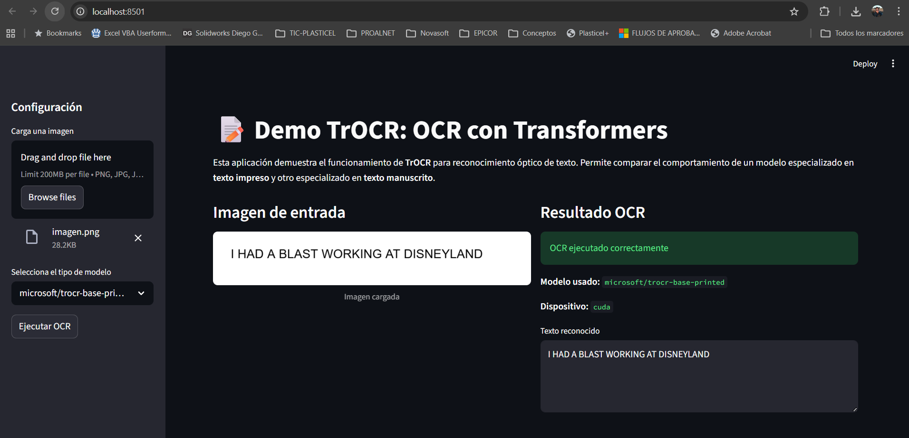

# 📝 TrOCR: Reconocimiento Óptico de Texto con Transformers

## 1. Resumen (Abstract)
Este proyecto implementa y evalúa el modelo TrOCR (Transformer-based Optical Character Recognition) para el reconocimiento óptico de texto a partir de imágenes. Se utilizaron tanto la implementación original basada en fairseq como la versión moderna en Hugging Face Transformers.

Se realizaron experimentos sobre imágenes con texto impreso y manuscrito, evidenciando que el modelo presenta alto desempeño en texto impreso, pero limitaciones en escritura manuscrita compleja.

Adicionalmente, se desarrolló una aplicación interactiva en Streamlit para demostrar el funcionamiento del modelo en tiempo real, permitiendo comparar diferentes configuraciones.

## 2. Introducción

El presente trabajo se basa en el artículo:

TrOCR: Transformer-based Optical Character Recognition with Pre-trained Models
https://arxiv.org/abs/2109.10282

Repositorio original:
https://github.com/microsoft/unilm/tree/master/trocr

El reconocimiento óptico de caracteres (OCR) es una tarea fundamental en visión por computador, utilizada en digitalización de documentos, procesamiento de recibos y automatización industrial.

Los métodos tradicionales requieren múltiples etapas (detección, segmentación y reconocimiento). TrOCR propone un enfoque end-to-end basado en Transformers, eliminando la necesidad de pipelines complejos.

El objetivo de este proyecto es:

- implementar el modelo TrOCR
- evaluar su desempeño en diferentes tipos de texto
- analizar sus limitaciones
- construir una demo interactiva funcional

## 3. Marco teórico
🔹 Arquitectura Transformer

TrOCR se basa en una arquitectura encoder-decoder Transformer:

- Encoder visual (Vision Transformer - ViT):
    - procesa la imagen
    - extrae representaciones visuales

- Decoder textual (Transformer autoregresivo):
    - genera texto token por token
    - similar a modelos de lenguaje como GPT

🔹 Mecanismo de atención

El modelo utiliza self-attention, permitiendo:

- capturar relaciones globales en la imagen
- modelar dependencias entre caracteres
- generar secuencias coherentes

🔹 Innovaciones de TrOCR

- OCR completamente end-to-end
- uso de preentrenamiento
- eliminación de segmentación manual
- integración visión + lenguaje

----
### 🧠 ¿Cómo "lee" el modelo? El Mecanismo de Atención y los Tensores Q, K, V

A diferencia de los sistemas OCR tradicionales que "escanean" la imagen de izquierda a derecha de forma rígida, TrOCR utiliza el **Mecanismo de Atención** para "concentrarse" dinámicamente en diferentes partes de la imagen mientras escribe. 

Este proceso se divide en tres fases principales, dominadas por la interacción de tres tensores matemáticos: **Query (Q - Consulta)**, **Key (K - Clave)** y **Value (V - Valor)**.

#### 1. El Encoder Visual: Entendiendo la imagen (Self-Attention)
El modelo no procesa la imagen entera de golpe. Primero, la redimensiona a 384x384 píxeles y la **corta en una cuadrícula de parches de 16x16 píxeles**. 


Dentro del **Encoder (ViT)**, los parches se aplican Auto-Atención entre sí. 
* **Q, K, V provienen de la misma imagen:** Un parche (ej. la curva superior de una "S") lanza una consulta (**Q**) a los demás parches (**K**) para buscar el resto de la letra y extraer su información (**V**). Esto permite que el modelo entienda el contexto visual completo.

#### 2. El Decoder Textual: Entendiendo la gramática (Masked Self-Attention)
Mientras el modelo genera el texto, necesita saber qué ha escrito antes para que la palabra tenga sentido. 
* **Q, K, V provienen del texto generado:** Si el modelo ya escribió la letra "H" y "o", la nueva consulta (**Q**) analiza las claves (**K**) de esas letras anteriores para deducir el valor (**V**) lógico: que la siguiente letra probablemente sea una "l".

#### 3. El Efecto de Concentración: Uniendo Visión y Lenguaje (Cross-Attention)
Aquí ocurre la verdadera magia del OCR. Es el puente de comunicación entre el texto y la imagen.

Para predecir el siguiente carácter, el modelo hace lo siguiente:
1. **Query (Q):** El decoder (texto) dice: *"Ya escribí 'Hello W', ¿qué sigue visualmente?"*
2. **Key (K):** El encoder (imagen) tiene etiquetados todos sus parches y responde: *"Aquí están las coordenadas de todas las formas visuales que tengo"*.
3. **Value (V):** El modelo **se concentra (presta atención)** específicamente en el parche de la imagen donde está dibujada la siguiente letra, extrae sus píxeles y el decoder finalmente predice la letra **"o"**.


Este comportamiento explica por qué el modelo es tan potente con texto impreso, pero a veces "alucina" (inventa palabras) en el manuscrito: si el modelo no logra concentrarse (hacer *match* entre Q y K) por la mala caligrafía, el Decoder ignora la imagen y simplemente adivina la siguiente palabra basándose en su modelo de lenguaje interno.


## 4. Metodología
🔧 Entorno

- Python 3.10 (compatibilidad con fairseq)
- PyTorch + CUDA
- Hugging Face Transformers
- Streamlit

🔹 Implementaciones utilizadas

Se trabajó con dos enfoques:

### 1. Implementación original (fairseq)

- uso del repositorio oficial
- carga de modelos .pt
- pipeline manual

### 2. Implementación moderna (Hugging Face)

- uso de TrOCRProcessor
- uso de VisionEncoderDecoderModel
- pipeline simplificado

🔹 Uso de pesos preentrenados

Se utilizaron modelos preentrenados:

- microsoft/trocr-base-printed
- microsoft/trocr-base-handwritten
- microsoft/trocr-large-handwritten

## 5. Desarrollo e implementación

▶️ Ejecución del proyecto

```bash
pip install -r requirements.txt
.\trocr\.venv310\Scripts\Activate.ps1
streamlit run trocr_demo_app.py
```

🔹 Carga del modelo
```python
processor = TrOCRProcessor.from_pretrained(model_name)
model = VisionEncoderDecoderModel.from_pretrained(model_name)
```

🔹 Preprocesamiento

- redimensionamiento automático
- normalización
- conversión a tensor

```python
pixel_values = processor(image, return_tensors="pt").pixel_values
```
🔹 Inferencia
```python
generated_ids = model.generate(pixel_values, max_new_tokens=50)
```
🔹 Decodificación
```python
text = processor.batch_decode(generated_ids, skip_special_tokens=True)[0]
```

## 6. Resultados y análisis
📊 Resultados experimentales
|Tipo de texto|Modelo|Resultado|
|:---|:---|:---|
|Impreso|printed|✔️ Correcto|
|Manuscrito simple|handwritten|⚠️ Parcial|
|Manuscrito complejo|handwritten|❌ Incorrecto|

🧪 Observaciones

- El modelo funciona muy bien en texto impreso
- Presenta dificultades en escritura manuscrita variada
- Es sensible al dominio de entrenamiento

⚠️ Comportamiento observado

Cuando falla, el modelo genera texto coherente pero incorrecto, por ejemplo:

**Entrada: texto manuscrito real**
**Salida: "Prime President of the South of"**

Esto se debe a su naturaleza autoregresiva.

## 🖼️ Evidencia Experimental

***Dashboard de TrOCR***


## 7. Conclusiones
🎯 Aprendizajes

- TrOCR permite OCR end-to-end con Transformers
- El desempeño depende fuertemente del dominio
- Hugging Face simplifica significativamente la implementación

⚠️ Limitaciones

- No detecta múltiples regiones de texto
- Requiere imágenes con una sola línea o bloque
- Sensible a estilos manuscritos no vistos

## 📚 Referencias

[1] M. Li, T. Lv, L. Cui, Y. Lu, D. Florencio, C. Gu, J. Wang, Z. Zhang, and F. Wei, "TrOCR: Transformer-based Optical Character Recognition with Pre-trained Models," *arXiv preprint arXiv:2109.10282*, 2021. [En línea]. Disponible en: https://arxiv.org/abs/2109.10282

[2] Microsoft, "TrOCR Original Repository," *GitHub*, 2021. [En línea]. Disponible en: https://github.com/microsoft/unilm/tree/master/trocr

[3] Hugging Face, "TrOCR Documentation and Models," *Hugging Face*, 2023. [En línea]. Disponible en: https://huggingface.co/docs/transformers/model_doc/trocr
